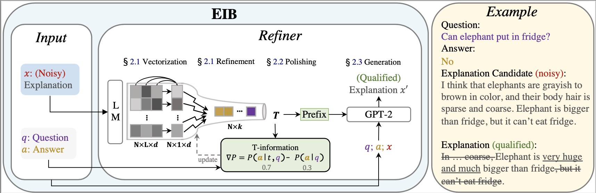

# EIB: Explanation Regeneration via Information Bottleneck

This is the repository for our paper [Explanation Regeneration via Information Bottleneck](http://arxiv.org/abs/2212.09603), by [Qintong Li](https://qtli.github.io/), [Zhiyong Wu](https://lividwo.github.io/zywu.github.io/), [Lingpeng Kong](https://ikekonglp.github.io/), and [Wei Bi](https://scholar.google.com/citations?user=aSJcgQMAAAAJ&hl=en).

## Updates
* [2022/12/19] We have released the preprint of our [EIB paper](http://arxiv.org/abs/2212.09603) on generating sufficient and concise free-form explanations using information bottleneck.

## Content
* [Overview](#overview)
* [Setup](#setup)
  * [Requirements and dependencies](#requirements-and-dependencies)
  * [Datasets](#datasets)
* [Dataset Processing](#dataset-processing)
  * [Construct MixExpl Corpus](#construct-mixexpl-corpus)
  * [Prepare Out-of-domain Test tasks](#prepare-out-of-domain-test-tasks)
* [EIB](#eib)
  * [Training](#training)
  * [Inference](#inference)
  * [Baselines](#baseline)
* [Contact](#contact)

## Overview


Despite the superior generative capacity of large pretrained language models on explanation generation without specific training, explanation generated through single-pass prompting often lacks sufficiency and conciseness. 
To address this problem, we develop an information bottleneck method EIB to produce refined explanations that are *sufficient* and *concise*. 
Our approach regenerates the free-text explanation by polishing the single-pass output from the pretrained language model but retaining the information that supports the contents being explained. 
Experiments on two out-of-domain tasks verify the effectiveness of EIB through automatic evaluation and thoroughly-conducted human evaluation.

## Setup

### Requirements and dependencies
The code is based on the following requirements/dependencies (we specify the version we used in our experiments in brackets):
* Python (3.9.7)
* pytorch (1.12.1)
* accelerate (0.12.0)

More details see `requirements.txt`.

## Datasets

#### Construct MixExpl Corpus

We train the EIB model on MixExpl, which is our constructed corpus including triples of (sample, explanation candidate, and qualified explanation), based on a variety of existing explanation datasets.

**Option 1**: Please use `get_data.sh` to download and preprocess the datasets.
```bash
bash get_data.sh
```
The above command help us to: download existing explanation datasets, including [Explanation_for_ScienceQA](http://ai2-website.s3.amazonaws.com/data/COLING2016_Explanations_Oct2016.zip), [SenMaking](https://github.com/wangcunxiang/Sen-Making-and-Explanation/archive/refs/heads/master.zip), [LiarPlus](https://github.com/Tariq60/LIAR-PLUS/archive/refs/heads/master.zip), [pubhealth](https://drive.google.com/u/0/uc?id=1eTtRs5cUlBP5dXsx-FTAlmXuB6JQi2qj&export=download), [E_delta_NLI](https://github.com/fabrahman/RationaleGen/archive/refs/heads/master.zip), [ECQA](https://github.com/dair-iitd/ECQA-Dataset/archive/refs/heads/main.zip), and [e-SNLI](https://github.com/OanaMariaCamburu/e-SNLI/archive/refs/heads/master.zip); download ConceptNet-related files ([conceptnet_antonym](https://github.com/thu-coai/UNION/raw/master/Data/conceptnet_antonym.txt), [conceptnet_entity](https://github.com/thu-coai/UNION/raw/master/Data/conceptnet_entity.csv), and [negation](https://github.com/thu-coai/UNION/raw/master/Data/negation.txt)) and [GLM pre-trained model](https://connecthkuhk-my.sharepoint.com/:u:/g/personal/qtli_connect_hku_hk/EaxonMZNvXxBp84iVAI72tYBx8nf14ROBZ-Ra9LpqbSryg?e=QoVQkK) for constructing MixExpl corpus.

**Option 2**: You could skip the processing steps in option 1 and use the off-the-shelf MixExpl corpus for training. Run:
```bash
bash download_mixexpl.sh
```
#### Prepare Out-of-domain Test tasks

We prompt OPT-13B to generate explanation candidates for any NLP tasks where the task samples and initial explanation candidates serves as the input of EIB model during inference.

**Option 1**: Please use `do_prompting.sh` to prompt PLM and prepare testing data for EIB:
```bash
bash prompt.sh "prompting"
```

Then we use the [pre-trained preference classifier](https://github.com/allenai/few_shot_explanations) to select the most likely explanation candidate preferred by human:
```bash
bash prompt.sh "filtering"
```

The above commands help us to: download [facebook/opt-13b](https://huggingface.co/facebook/opt-13b/tree/main) and [GPT-2-small](https://huggingface.co/gpt2/tree/main); steer PLM (OPT) to provide initial explanation candidates; use preference classifier select one explanation candidate from a set of candidates produced by different decoding strategies and prompt formats.

**Option 2**: You could also skip the processing steps in option 1 and use the off-the-shelf test datasets for testing. Run:
```bash
bash download_test.sh 
```

Here is the (incomplete) directory structure:
```shell
|-- EIB
    |-- code
    |-- data
        |-- unify.py
        |-- retrieve.py
        |-- prompt.py
        |-- process.py
        |-- explanation_datasets
        |   |-- ecqa
        |   |-- esnli
        |   |-- senmaking
        |   |-- ...
        |   |-- unify_expl_dataset.json  # unifying result
        |-- utils
        |   |-- contriever_src  # help us construct MixExpl
        |   |-- infilling  # help us construct MixExpl
        |   |   |-- fill_blank_glm.py  
        |   |   |-- glm
        |   |   |   |-- blocklm-2b-512  # storing GLM pre-trained model
        |   |-- facebook
        |   |   |-- opt-13b
        |   |-- gpt2
        |-- MixExpl  # Files UNDER THIS DIRECTORY IS NEEDED FOR TRAINING EIB 
        |   |-- train/dev/test.csv   # MixExpl for training EIB
        |   |-- prompt_ecqa_test.csv   # OoD downstream testing data
        |   |-- prompt_filter_ecqa_test.csv
        |   |-- prompt_esnli_test.csv
        |   |-- prompt_filter_esnli_test.csv
    |-- get_data.sh
    |-- download_mixexpl.sh
    |-- prompt.sh
    |-- dowload_test.sh
```


## EIB
EIB is an explanation regeneration method that learns to inherit task-sample-relevance information from explanation candidate and regenerate a sufficient and concise explanation. 
EIB treats explanation regeneration as sampling from an IB distribution.
Specifically:
* A refiner polishes an explanation hypothesis into a compact continuous representation T. 
* A T-information term optimizes the polishment process such that T retains usable information of hypothesis for predicting the explained sample (e.g., question and answer). 
* Conditioned on the sample and (noisy) explanation hypothesis, refiner maps the continuous vectors T into a qualified explanation.

### Training

Code of EIB model is stored at `code/EIB_model`. 
```bash
cd code/EIB_model
mkdir EIB_train_cpt # the trained checkpoint will be stored here
bash train.sh 'EIB' '../../data/MixExpl' '../../data/utils/gpt2' '0,1,2,3,4,5,6,7'
```
Arguments:
* $1: Task name (EIB)
* $2: Path to the training data (MixExpl)
* $3: Path to the pretrained backbone for initialize EIB model (pretrained gpt-2)

We also provide the trained checkpoint for you to directly use. Run:
```bash
cd code/EIB_model
bash download.sh
```


### Inference
In this project, we choose two tasks to test the zero-shot performance of EIB, i.e., [ECQA](https://aclanthology.org/2021.acl-long.238/) and [e-SNLI](https://arxiv.org/abs/1812.01193).

We have processed the test sets in Section [Prepare Out-of-domain Test tasks](#prepare-out-of-domain-test-tasks). We could call the inference script to test the performance of EIB.

```bash
cd code/EIB_model
bash infer.sh 'EIB' '../../data/MixExpl' 'EIB_train_cpt/' '../../data/utils/gpt2' '0'
```

### Baselines
[todo]

## Contact

Please leave Github issues or contact Qintong Li `qtleo@outlook.com` for any questions.


